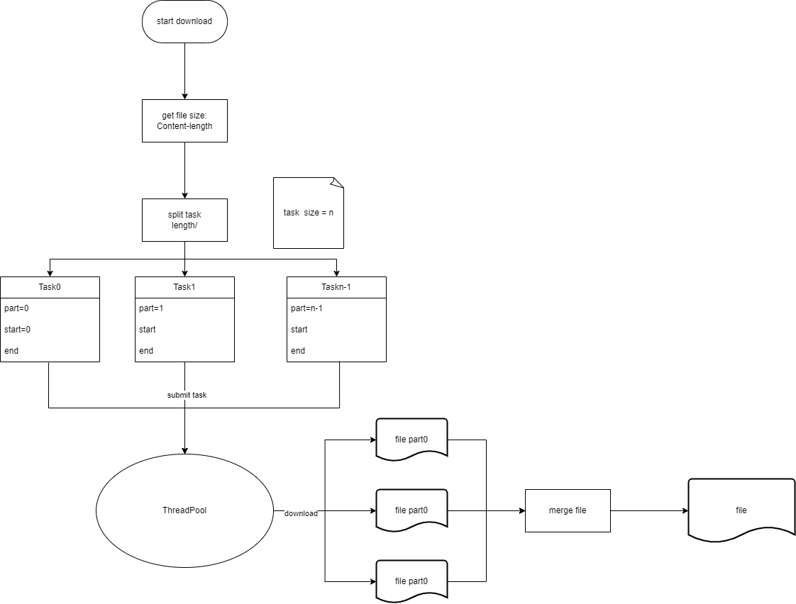

# RangeDownload

Example of HTTP Content-Range Download.

## How it works

- **Range**: Use HTTP header `Range` to download a range of bytes.For example, say we have to download a file `foo.txt`,
  it's content-length is 30 bytes, and we split it into three parts:
    - `Range: bytes=0-10`
    - `Range: bytes=10-20`
    - `Range: bytes=20-30`

- **Integrity check**: And We also use `etag` to check if the file has changed, and if so, we download it again.
- **Continuously download**: When a file is partially downloaded 5 bytes and then the network is interrupted. The file will
  start to be downloaded at `Range: bytes=5-10` again once the network is reconnected.